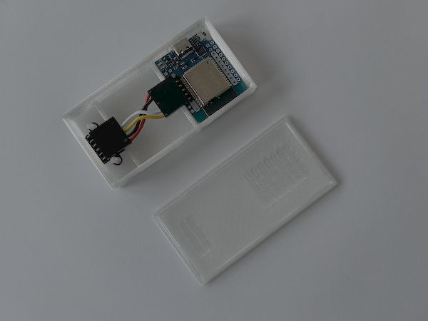
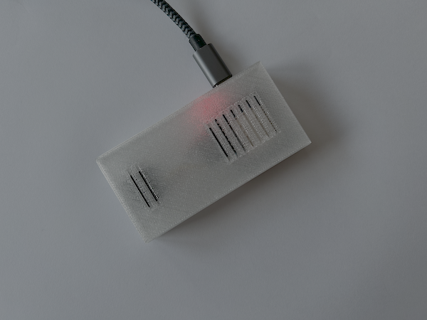
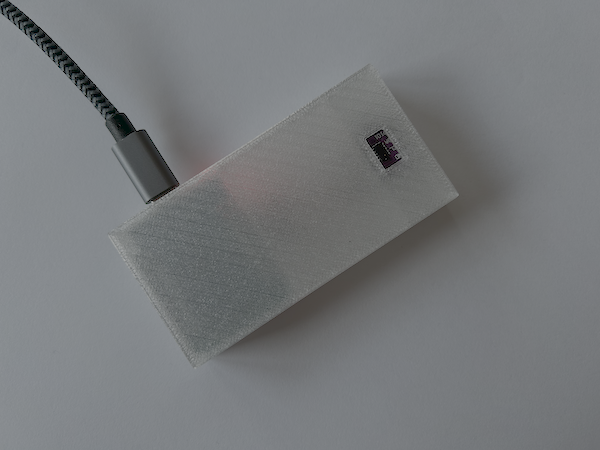
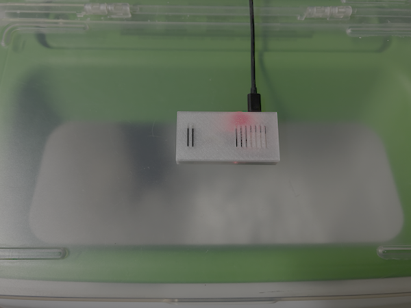

# water-softener-sensor.makefile

A vl53l0x-based sensor for a water softener to detect the regeneration salt level, using ESPHome.

## Images






## Development Environment

Set up the environment and install ESPHome:

```
.env/init
source .env/activate
```

Create a `secrets.yaml` file based on `secrets.yaml.template` and configure the OTA password and WiFi details.

Connect the ESP device to your USB port and compile and install the software:

```
esphome run water-softener-sensor.yaml
```

